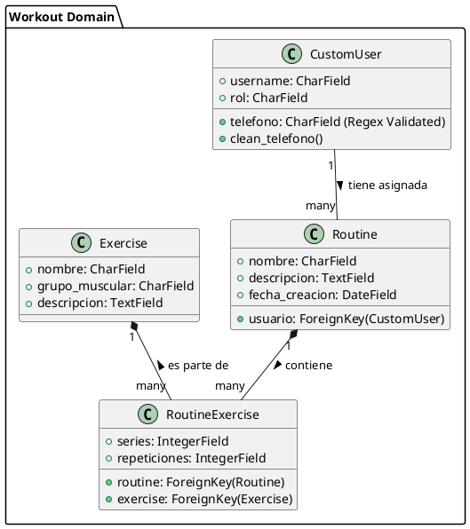

# Inventario DCRM - Sistema de Gestión de Gimnasios

Bienvenido al repositorio oficial del proyecto **Inventario DCRM**, una plataforma web robusta desarrollada con Django para la gestión integral de membresías, rutinas de ejercicio, inventario y clientes de un gimnasio.

---

## 🎯 Características Principales

*   **Autenticación y Roles de Usuario:** Sistema de login seguro de 4 capas (Roles: Administrador, Personal, Cliente).
*   **Gestión de Rutinas y Ejercicios:** CRUD completo para la creación y asignación de rutinas personalizadas a los clientes.
*   **Single Page Application (SPA):** Navegación ultra fluida sin recargas completas de página utilizando **HTMX**.
*   **Seguridad Reforzada:** Validaciones estrictas con Expresiones Regulares (Regex) en Frontend y Backend para mitigar inyecciones y datos maliciosos.
*   **Interfaz Local:** Diseño moderno basado en Bootstrap 5 y Chart.js, 100% alojado localmente sin dependencia de CDNs externas.

---

## 🏗️ Identificación de Patrones de Diseño

Durante el desarrollo de este proyecto se han aplicado múltiples patrones de diseño arquitecturales y estructurales para garantizar un código limpio, mantenible y escalable:

### 1. Patrón Arquitectural MVT (Model-View-Template)
Es la variante del clásico MVC utilizada por Django. 
*   **Model:** Define la estructura de datos (ej. `CustomUser`, `Routine`, `Exercise`).
*   **View:** Contiene la lógica de negocio y hace de puente entre Model y Template (ej. `staff_dashboard`, `create_routine`).
*   **Template:** Define la capa de presentación utilizando HTML y CSS local (ej. `staff_dashboard.html`).

### 2. Principio DRY (Don't Repeat Yourself) mediante `ModelForm`
Se utilizó el patrón de fábrica (Factory) a través de `ModelForm` de Django. En lugar de reescribir manualmente cada campo HTML y sus reglas de validación en las vistas, delegamos esta creación al modelo, generando automáticamente formularios seguros (`RoutineForm`, `ExerciseForm`, `SignUpForm`).

### 3. Patrón Decorator (Decoradores)
Se utilizan funciones decoradoras para añadir comportamiento a las vistas sin modificar su código interno, gestionando el control de acceso de forma modular. Ejemplo: `@login_required` y los decoradores personalizados como `@allowed_users(allowed_roles=['admin'])`.

---

## 📐 Arquitectura y Modelado UML (Modelo C4)

A continuación se presentan los diagramas de arquitectura basados en el **Modelo C4** utilizando notación PlantUML. Estos describen la estructura del sistema desde la vista más general hasta el código.

### Nivel 1: Diagrama de Contexto (C1)

Muestra cómo interactúan los diferentes tipos de usuarios con el sistema a un alto nivel.

```plantuml
@startuml Contexto_C1
!include https://raw.githubusercontent.com/plantuml-stdlib/C4-PlantUML/master/C4_Context.puml

Person(cliente, "Cliente", "Usuario del gimnasio que consulta sus rutinas y progreso.")
Person(staff, "Personal / Entrenador", "Crea rutinas, gestiona ejercicios y monitorea clientes.")
Person(admin, "Administrador", "Gestiona la configuración global, inventario y todos los roles.")

System(dcrm, "Inventario DCRM", "Sistema web central que permite la gestión de usuarios, rutinas, progreso e inventario del gimnasio.")

Rel(cliente, dcrm, "Consulta rutinas y actualiza su progreso", "HTTPS/HTMX")
Rel(staff, dcrm, "Crea y asigna rutinas", "HTTPS/HTMX")
Rel(admin, dcrm, "Gestiona el sistema completo", "HTTPS/HTMX")
@enduml
```

### Nivel 2: Diagrama de Contenedores (C2)

Desglosa el sistema "Inventario DCRM" en los contenedores físicos que lo componen.

```plantuml
@startuml Contenedores_C2
!include https://raw.githubusercontent.com/plantuml-stdlib/C4-PlantUML/master/C4_Container.puml

Person(usuario, "Usuario (Admin/Staff/Cliente)", "Interactúa con la interfaz web.")

System_Boundary(dcrm_boundary, "Inventario DCRM") {
    Container(web_app, "Aplicación Web Django", "Python, Django", "Procesa las reglas de negocio, renderiza vistas y maneja seguridad MVT.")
    Container(spa_frontend, "Interfaz SPA (Frontend)", "HTML, Bootstrap, HTMX", "Interfaz de usuario fluida sin recargas completas, con validaciones Regex.")
    ContainerDb(database, "Base de Datos", "SQLite/PostgreSQL", "Almacena usuarios, rutinas, ejercicios e inventario.")
}

Rel(usuario, spa_frontend, "Navega e interactúa", "HTTPS")
Rel(spa_frontend, web_app, "Solicita vistas y envía datos", "AJAX/HTMX")
Rel(web_app, database, "Lee y escribe registros", "ORM de Django")
@enduml
```

### Nivel 3: Diagrama de Componentes (C3)

Detalla los módulos internos de la Aplicación Web Django.

```plantuml
@startuml Componentes_C3
!include https://raw.githubusercontent.com/plantuml-stdlib/C4-PlantUML/master/C4_Component.puml

Container_Boundary(web_app, "Aplicación Web Django") {
    Component(accounts_app, "Accounts App", "Módulo Django", "Maneja el login, registro y modelo CustomUser.")
    Component(workout_app, "Workout App", "Módulo Django", "Maneja el CRUD de Rutinas, Ejercicios y Sesiones.")
    Component(inventory_app, "Inventory/Website App", "Módulo Django", "Maneja la vista central (Dashboard), estilos y reportes gráficos.")
    
    Component(auth_middleware, "Security Middleware", "Django", "Verifica CSRF, Regex y Decoradores de Roles.")
}

ContainerDb(database, "Base de Datos", "SQLite", "Modelos relacionales")

Rel(accounts_app, database, "SQL")
Rel(workout_app, database, "SQL")
Rel(inventory_app, database, "SQL")
Rel(auth_middleware, accounts_app, "Intercepta peticiones de login")
@enduml
```

### Nivel 4: Diagrama de Código (C4)

Muestra la relación a nivel de código entre las clases principales del dominio de Rutinas y Ejercicios.



---

## 🛠️ Instalación y Ejecución

### 1. Clonar el repositorio
```bash
git clone https://github.com/saracruz98/django-3.git
cd django-3/inventario_django/dcrm
```

### 2. Activar entorno virtual e instalar dependencias
```bash
# Activar entorno
.\env\Scripts\activate
# Instalar los requerimientos
pip install -r requirements.txt
```

### 3. Aplicar migraciones e iniciar
```bash
python manage.py makemigrations
python manage.py migrate
python manage.py runserver
```

> **Nota de Seguridad:** Se han implementado 4 capas de seguridad. Asegúrese de probar crear un usuario con caracteres especiales (`<, >, %`) para comprobar que los validadores Regex detienen el ataque en el frontend y en el backend.

---
*Documentación generada para cumplir con la rúbrica completa del proyecto web.*
